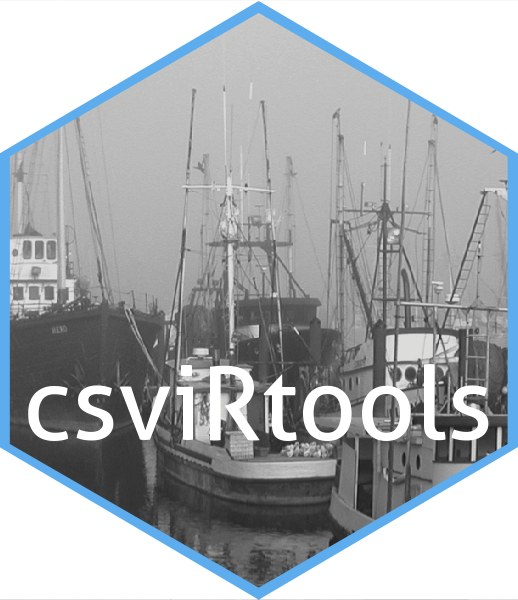

# csviRtools 

## csviRtools: Tools for constructing and accessing social vulnerability indicator measures

This package is a growing set of tools for simplifying the process of constructing and assessing social vulnerability indicator measures used to compare communities horizontally. 

Find more information about social indicator measures at:

https://www.fisheries.noaa.gov/national/socioeconomics/social-indicators-coastal-communities

### Installation:

``` r
install.packages("remotes")
remotes::install_github("connorlewissmith/csviRtools")
```

### Use:

pca_table()

This function allows for the quick creation of summary statistics from numeric variables used in a PCA indicator measure.  

``` r
df <- data(iris)

cols <- c("Sepal.Length", "Sepal.Width", "Petal.Length", "Petal.Width")

pca_table(df, cols)

```

